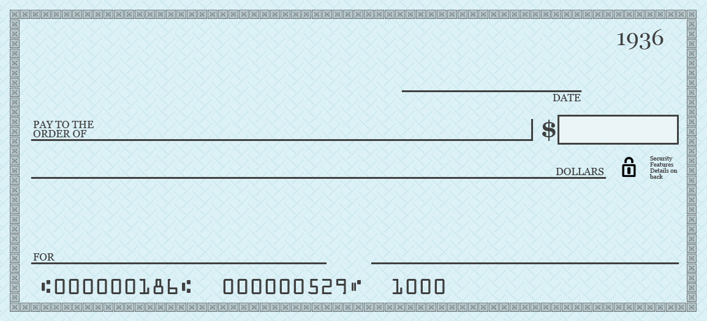

# Problema en Loterias de la Ciudad

Somos parte del equipo de *Loterias de la Ciudad* y nos llega la noticia que alguien se ha ganado la lotería y se llevará un gran pozo!  
Nuestra tarea será entonces imprimir un cheque por el monto **N** que respresenta el pozo.

 

Sin embargo, cuando intentamos imprimir este gran cheque, encontramos un problema. El valor **N**, el cual es un entero, incluye al menos un dígito que es 4... y el 4 es un número que no funciona en nuestra impresora.

Afortunadamente, encontramos otra forma de hacerlo: enviaremos a nuestro ganador dos cheques por un monto **A** y otro por **B**, siendo **A** y **B** dos enteros positivos los cuales ninguno de ellos tiene como un dígito el número 4 y **A + B = N**.

¿Nos ayudarías a encontrar algún par de valores A y B que satisfaga nuestras condiciones? 

## ¿Cómo empiezo?

En este directorio se provee una clase java `Solution.java` en donde se tendrá que implementar la solución.
El método `public static SolutionDTO getSolution(int n)` retorna un dto conteniendo los números a y b.

## Consideraciones

* Se puede considerar que siempre existe la solución dado un **N**
* N siempre tiene un dígito 4 
* No es necesario validar el input

## Restricciones 

* **Límite de tiempo de procesamiento:** dado un N, 10s máximo para el cálculo de A y B
* **Límite de memoria:** 1GB

## Consejos

Probar con números en el rango de: 1 < N < 105 y 1 < N < 109
